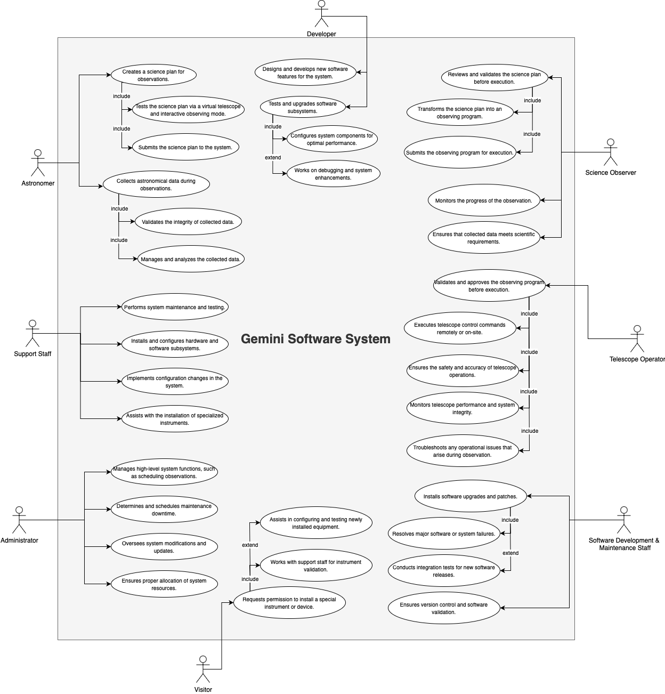

# D2: Use case diagram

## Short description of each use case

## Astronomer

- **Astronomer** creates a science plan for observations.
- **Astronomer** tests the science plan via a virtual telescope and interactive observing mode.
- **Astronomer** submits the science plan to the system.
- **Astronomer** collects astronomical data during observations.
- **Astronomer** validates the integrity of collected data.
- **Astronomer** manages and analyzes the collected data.

## Science Observer

- **Science Observer** reviews and validates the science plan before execution.
- **Science Observer** transforms the science plan into an observing program.
- **Science Observer** submits the observing program for execution.
- **Science Observer** monitors the progress of the observation.
- **Science Observer** ensures that collected data meets scientific requirements.

## Telescope Operator

- **Telescope Operator** validates and approves the observing program before execution.
- **Telescope Operator** executes telescope control commands remotely or on-site.
- **Telescope Operator** ensures the safety and accuracy of telescope operations.
- **Telescope Operator** monitors telescope performance and system integrity.
- **Telescope Operator** troubleshoots any operational issues that arise during observation.

## Support Staff

- **Support Staff** performs system maintenance and testing.
- **Support Staff** installs and configures hardware and software subsystems.
- **Support Staff** implements configuration changes in the system.
- **Support Staff** assists with the installation of specialized instruments.

## Developer

- **Developer** designs and develops new software features for the system.
- **Developer** tests and upgrades software subsystems.
- **Developer** configures system components for optimal performance.
- **Developer** works on debugging and system enhancements.

## Administrator

- **Administrator** manages high-level system functions, such as scheduling observations.
- **Administrator** determines and schedules maintenance downtime.
- **Administrator** oversees system modifications and updates.
- **Administrator** ensures proper allocation of system resources.

## Software Development & Maintenance Staff

- **Software Development & Maintenance Staff** installs software upgrades and patches.
- **Software Development & Maintenance Staff** resolves major software or system failures.
- **Software Development & Maintenance Staff** conducts integration tests for new software releases.
- **Software Development & Maintenance Staff** ensures version control and software validation.

## Visitor

- **Visitor** requests permission to install a special instrument or device.
- **Visitor** works with support staff for instrument validation.
- **Visitor** assists in configuring and testing newly installed equipment.
